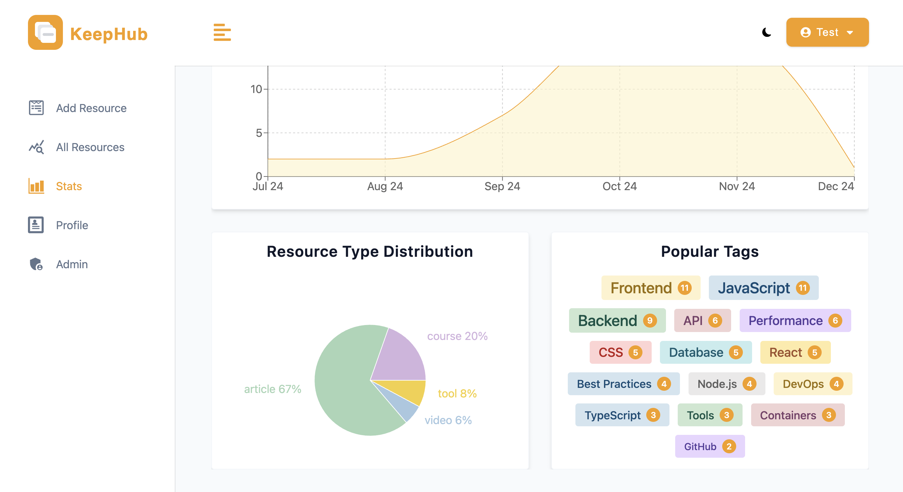

# KeepHub - Digital Resource Management System

<div align="center">
  
  
  **A modern MERN stack application for organizing and managing your digital resources**
  
  [](https://mongodb.com/)
  [](https://expressjs.com/)
  [](https://reactjs.org/)
  [](https://nodejs.org/)
  [](https://vitejs.dev/)
</div>


## Overview

KeepHub is a comprehensive digital resource management system built with the MERN stack. It helps you organize, track, and manage your learning resources including articles, videos, tools, and courses with powerful analytics, search capabilities, and AI-powered content analysis using Google Gemini AI.


## Features

### Resource Management
- **CRUD Operations**: Add, edit, delete, and view digital resources
- **Status Tracking**: Track resources as 'to read', 'in progress', 'completed', or 'reference'
- **Type Classification**: Organize by type - video, article, tool, course, book, podcast
- **Tagging System**: Custom tags for flexible organization
- **Notes & URLs**: Store additional information and direct links

### AI Content Analysis
- **Smart URL Analysis**: Automatically extract metadata from any URL
- **Intelligent Suggestions**: AI-powered title, platform, and type detection
- **Auto-tagging**: Generate relevant tags based on content analysis
- **Content Summarization**: Create concise summaries using Google Gemini AI
- **Caching System**: 24-hour cache for faster repeated analysis

### Analytics Dashboard
- Resource status distribution charts
- Resource type statistics  
- Monthly addition trends
- Interactive tag cloud visualization
- Progress tracking over time

### Search & Filter
- Real-time search with debouncing
- Filter by status, type, and tags
- Sort by newest, oldest, alphabetical (a-z, z-a)
- Advanced search capabilities
- Responsive search interface

### User Experience
- Responsive design for all devices
- Dark/Light theme toggle
- Smooth animations and transitions
- Intuitive navigation
- Clean, modern interface


## Tech Stack

### Frontend
- **React 18** - Modern UI library
- **React Router 6** - Client-side routing
- **React Query** - Data fetching and caching
- **Recharts** - Interactive charts and graphs
- **Styled Components** - CSS-in-JS styling
- **React Icons** - Icon library
- **Axios** - HTTP client
- **Vite** - Fast build tool

### Backend
- **Node.js** - Runtime environment
- **Express.js** - Web framework
- **MongoDB** - NoSQL database
- **Mongoose** - ODM for MongoDB
- **JWT** - Authentication tokens
- **bcryptjs** - Password hashing
- **Multer** - File upload handling
- **Cloudinary** - Image hosting and management

### AI & Content Analysis
- **Google Gemini AI** - Advanced content analysis and summarization
- **Cheerio** - Web scraping for content extraction
- **Axios** - HTTP client for web content fetching
- **Smart Caching** - 24-hour intelligent result caching system
- **URL Parse** - URL parsing utilities

### Security & Performance
- **Helmet** - Security headers
- **Express Rate Limit** - Rate limiting
- **Express Mongo Sanitize** - NoSQL injection prevention
- **Cookie Parser** - Cookie handling
- **Morgan** - HTTP request logging


## Quick Start

### Prerequisites
- Node.js (v18 or higher)
- MongoDB database
- npm or yarn
- Google Gemini API key (for AI features)

### Installation

1. **Clone the repository**
   ```bash
   git clone https://github.com/yoasaaa/KeepHub.git
   cd keephub
   ```

2. **Install dependencies**
   ```bash
   npm run setup-project
   ```

3. **Environment setup**
   ```bash
   cp .env.example .env
   # Edit .env with your configuration
   ```

4. **Start development server**
   ```bash
   npm run dev
   ```

5. **Access the application**
   - Frontend: http://localhost:5173
   - Backend API: http://localhost:5100

### Environment Variables
```env
NODE_ENV=development
PORT=5100
MONGO_URL=your_mongodb_connection_string
JWT_SECRET=your_jwt_secret_key
JWT_EXPIRES_IN=1d
CLOUD_NAME=your_cloudinary_name
CLOUD_API_KEY=your_cloudinary_api_key
CLOUD_API_SECRET=your_cloudinary_api_secret
GEMINI_API_KEY=your_google_gemini_api_key
```

### Demo Data
1. Register with email: `test@test.com` and password: `secret123`
2. Then run the populate script to add sample resources:
   ```bash
   npm run populate
   ```


## Application Screenshots

### Adding New Resources


### AI Content Analysis


### Search and Filter


### Search Results


### Analytics and Charts



### Dark Theme


## Database Schema

### Resource Model
```javascript
{
  title: String,
  platform: String,
  url: String,
  resourceType: {
    type: String,
    enum: ['video', 'article', 'tool', 'course', 'book', 'podcast', 'other'],
    default: 'article'
  },
  resourceStatus: {
    type: String,
    enum: ['to read', 'in progress', 'completed', 'reference'],
    default: 'to read'
  },
  tags: [String],
  notes: String,
  createdBy: {
    type: mongoose.Types.ObjectId,
    ref: 'User'
  },
  timestamps: true
}
```

### User Model
```javascript
{
  name: String,
  email: String,
  password: String,
  lastName: {
    type: String,
    default: 'lastName'
  },
  role: {
    type: String,
    enum: ['user', 'admin'],
    default: 'user'
  },
  avatar: String,
  avatarPublicId: String
}
```

### Analysis Model
```javascript
{
  url: {
    type: String,
    required: true
  },
  userId: {
    type: mongoose.Types.ObjectId,
    ref: 'User',
    required: true
  },
  success: {
    type: Boolean,
    required: true
  },
  aiAnalysis: {
    suggestedTitle: String,
    suggestedPlatform: String,
    suggestedType: {
      type: String,
      enum: ['video', 'article', 'tool', 'course', 'book', 'podcast', 'other']
    },
    suggestedTags: [String],
    generatedSummary: String
  },
  applied: {
    type: Boolean,
    default: false
  },
  timestamps: true
}
```


## API Documentation

### Authentication Endpoints
- `POST /api/v1/auth/register` - User registration
- `POST /api/v1/auth/login` - User login
- `GET /api/v1/auth/logout` - User logout

### Resource Endpoints
- `GET /api/v1/resources` - Get all resources (with search/filter)
- `POST /api/v1/resources` - Create new resource
- `GET /api/v1/resources/:id` - Get single resource
- `PATCH /api/v1/resources/:id` - Update resource
- `DELETE /api/v1/resources/:id` - Delete resource
- `GET /api/v1/resources/stats` - Get resource statistics
- `GET /api/v1/resources/tags` - Get all unique tags

### User Endpoints
- `GET /api/v1/users/current-user` - Get current user
- `PATCH /api/v1/users/update-user` - Update user profile (supports avatar upload)
- `GET /api/v1/users/admin/app-stats` - Admin statistics (requires admin role)

### AI Analysis Endpoints
- `POST /api/v1/ai-analysis/analyze` - Analyze content from URL
- `PUT /api/v1/ai-analysis/:analysisId/usage` - Track which AI suggestions were applied


## Project Structure

```
keephub/
├── client/                 # React frontend
│   ├── public/            # Static assets
│   ├── src/
│   │   ├── components/    # Reusable UI components
│   │   ├── pages/         # Page components
│   │   ├── assets/        # Images & styled components
│   │   └── utils/         # Frontend utilities
│   ├── index.html         # HTML entry point
│   ├── package.json       # Frontend dependencies
│   └── vite.config.js     # Vite configuration
├── controllers/           # Express route handlers
├── errors/               # Custom error classes
├── middleware/           # Custom middleware
├── models/               # Mongoose schemas
├── routes/               # Express routes
├── utils/                # Backend utilities
├── screenshots/          # Application screenshots
├── package.json          # Backend dependencies
├── populate.js           # Database population script
└── server.js             # Express server entry point
```


## Available Scripts

- `npm run dev` - Start both server and client in development mode
- `npm run server` - Start only the backend server
- `npm run client` - Start only the frontend development server
- `npm run setup-project` - Install dependencies for both client and server
- `npm run setup-production-app` - Build application for production
- `npm run start` - Start production server
- `npm run populate` - Populate database with sample data


## Contributing

1. Fork the repository
2. Create your feature branch (`git checkout -b feature/AmazingFeature`)
3. Commit your changes (`git commit -m 'Add some AmazingFeature'`)
4. Push to the branch (`git push origin feature/AmazingFeature`)
5. Open a Pull Request

<div align="center">
  <strong>⭐ Star this repository if you find it helpful!</strong>
</div> 
