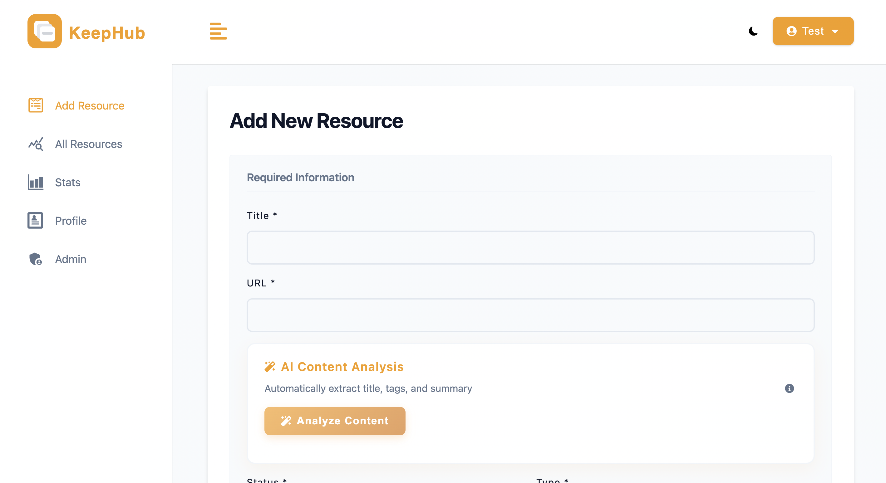
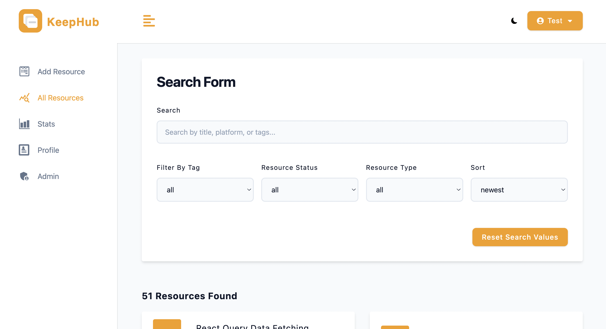
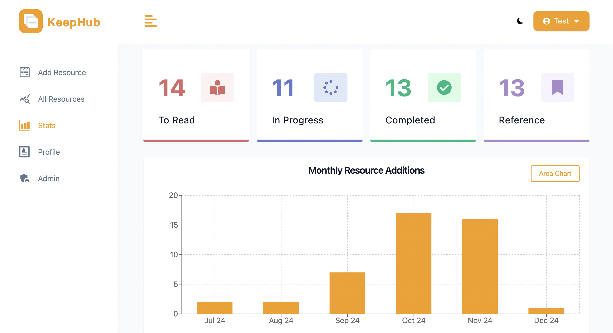

# KeepHub - Digital Resource Management System

<div align="center">
  
  
  **A modern MERN stack application for organizing and managing your digital resources**
  
  [](https://opensource.org/licenses/MIT)
  [](https://nodejs.org/)
  [](https://reactjs.org/)
  [](https://mongodb.com/)
</div>


## Overview

KeepHub is a comprehensive digital resource management system built with the MERN stack. It helps you organize, track, and manage your learning resources including articles, videos, tools, and courses with powerful analytics and search capabilities.


## Features

### Resource Management
- **CRUD Operations**: Add, edit, delete, and view digital resources
- **Status Tracking**: Track resources as 'to read', 'in progress', 'completed', or 'reference'
- **Type Classification**: Organize by type - video, article, tool, course
- **Tagging System**: Custom tags for flexible organization
- **Notes & URLs**: Store additional information and direct links

### Analytics Dashboard
- Resource status distribution charts
- Resource type statistics  
- Monthly addition trends
- Interactive tag cloud visualization
- Progress tracking over time

### Search & Filter
- Real-time search with debouncing
- Filter by status, type, and tags
- Sort by newest, oldest, alphabetical (a-z, z-a)
- Advanced search capabilities
- Responsive search interface

### User Experience
- Responsive design for all devices
- Dark/Light theme toggle
- Smooth animations and transitions
- Intuitive navigation
- Clean, modern interface


## Tech Stack

### Frontend
- **React 18** - Modern UI library
- **React Router 6** - Client-side routing
- **React Query** - Data fetching and caching
- **Recharts** - Interactive charts and graphs
- **Styled Components** - CSS-in-JS styling
- **React Icons** - Icon library
- **Axios** - HTTP client
- **Vite** - Fast build tool

### Backend
- **Node.js** - Runtime environment
- **Express.js** - Web framework
- **MongoDB** - NoSQL database
- **Mongoose** - ODM for MongoDB
- **JWT** - Authentication tokens
- **bcryptjs** - Password hashing
- **Multer** - File upload handling

### Security & Performance
- **Helmet** - Security headers
- **Express Rate Limit** - Rate limiting
- **Express Mongo Sanitize** - NoSQL injection prevention
- **CORS** - Cross-origin resource sharing


## Quick Start

### Prerequisites
- Node.js (v14 or higher)
- MongoDB database
- npm or yarn

### Installation

1. **Clone the repository**
   ```bash
   git clone https://github.com/yoasaaa/KeepHub.git
   cd keephub
   ```

2. **Install dependencies**
   ```bash
   npm run setup-project
   ```

3. **Environment setup**
   ```bash
   cp .env.example .env
   # Edit .env with your configuration
   ```

4. **Start development server**
   ```bash
   npm run dev
   ```

5. **Access the application**
   - Frontend: http://localhost:5173
   - Backend API: http://localhost:5100

### Environment Variables
```env
NODE_ENV=development
PORT=5100
MONGO_URL=your_mongodb_connection_string
JWT_SECRET=your_jwt_secret_key
JWT_EXPIRES_IN=1d
CLOUDINARY_NAME=your_cloudinary_name
CLOUDINARY_API_KEY=your_cloudinary_api_key
CLOUDINARY_API_SECRET=your_cloudinary_api_secret
```

### Demo Data
1. Register with email: `test@test.com` and password: `secret123`
2. Run the populate script:
   ```bash
   npm run populate
   ```


## Application Screenshots

### Adding New Resources


### Search and Filter


### Search Results


### Analytics and Charts



### Dark Theme


## Database Schema

### Resource Model
```javascript
{
  title: String,
  platform: String,
  url: String,
  resourceType: {
    type: String,
    enum: ['video', 'article', 'tool', 'course'],
    default: 'article'
  },
  resourceStatus: {
    type: String,
    enum: ['to read', 'in progress', 'completed', 'reference'],
    default: 'to read'
  },
  tags: [String],
  notes: String,
  createdBy: ObjectId,
  timestamps: true
}
```

### User Model
```javascript
{
  name: String,
  email: String,
  password: String,
  lastName: String,
  role: {
    type: String,
    enum: ['user', 'admin'],
    default: 'user'
  },
  avatar: String,
  avatarPublicId: String
}
```


## API Documentation

### Authentication Endpoints
- `POST /api/v1/auth/register` - User registration
- `POST /api/v1/auth/login` - User login
- `GET /api/v1/auth/logout` - User logout

### Resource Endpoints
- `GET /api/v1/resources` - Get all resources (with search/filter)
- `POST /api/v1/resources` - Create new resource
- `GET /api/v1/resources/:id` - Get single resource
- `PATCH /api/v1/resources/:id` - Update resource
- `DELETE /api/v1/resources/:id` - Delete resource
- `GET /api/v1/resources/stats` - Get resource statistics

### User Endpoints
- `GET /api/v1/users/current-user` - Get current user
- `PATCH /api/v1/users/update-user` - Update user profile
- `GET /api/v1/users/admin/app-stats` - Admin statistics


## Project Structure

```
keephub/
├── client/                 # React frontend
│   ├── src/
│   │   ├── components/    # Reusable UI components
│   │   ├── pages/         # Page components
│   │   ├── assets/        # Images & styled components
│   │   └── utils/         # Frontend utilities
├── controllers/           # Express route handlers
├── middleware/           # Custom middleware
├── models/               # Mongoose schemas
├── routes/               # Express routes
├── utils/                # Backend utilities
└── server.js             # Express server entry point
```


## Available Scripts

- `npm run dev` - Start both server and client in development
- `npm run server` - Start only the backend server
- `npm run client` - Start only the frontend development server
- `npm run setup-project` - Install dependencies for both client and server
- `npm run setup-production-app` - Build application for production
- `npm run populate` - Populate database with sample data


## Contributing

1. Fork the repository
2. Create your feature branch (`git checkout -b feature/AmazingFeature`)
3. Commit your changes (`git commit -m 'Add some AmazingFeature'`)
4. Push to the branch (`git push origin feature/AmazingFeature`)
5. Open a Pull Request


## License

This project is licensed under the MIT License - see the [LICENSE](LICENSE) file for details.


<div align="center">
  <strong>⭐ Star this repository if you find it helpful!</strong>
</div> 